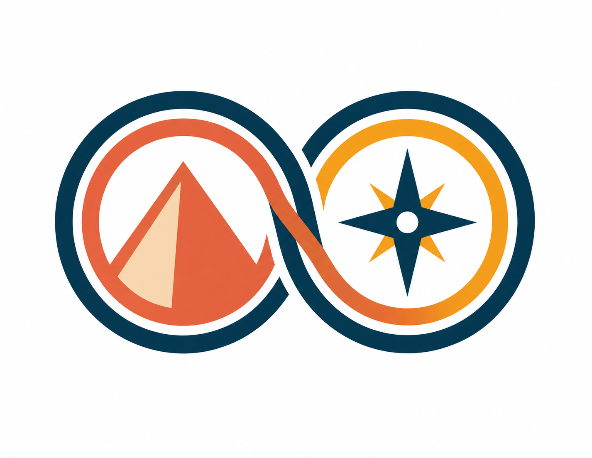
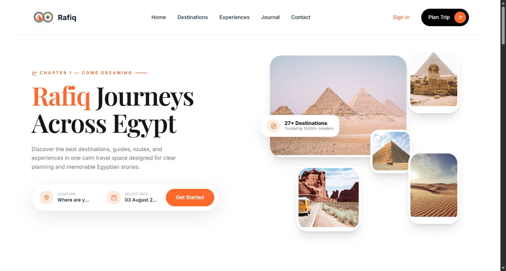
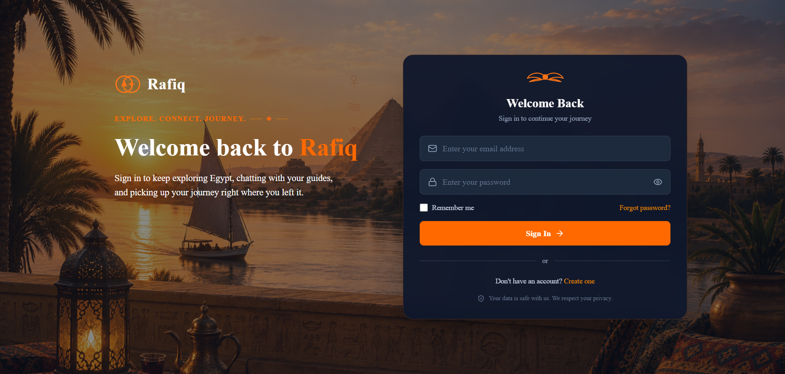
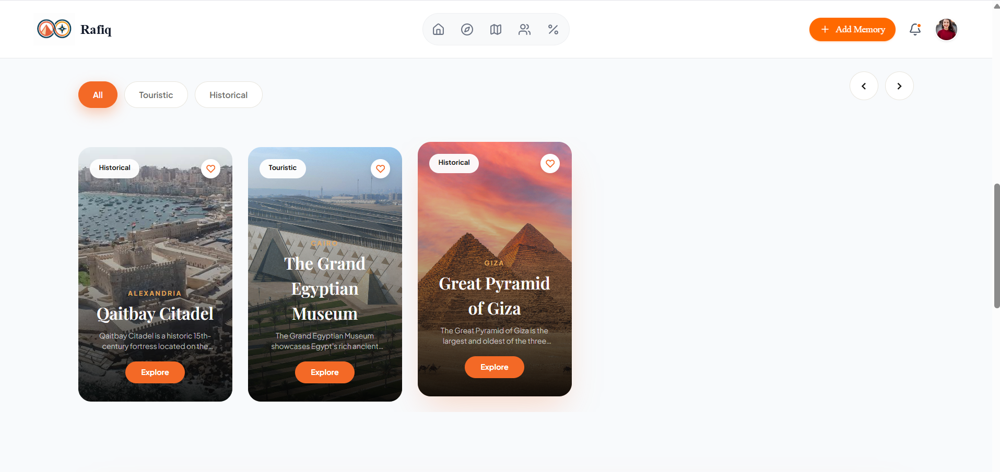
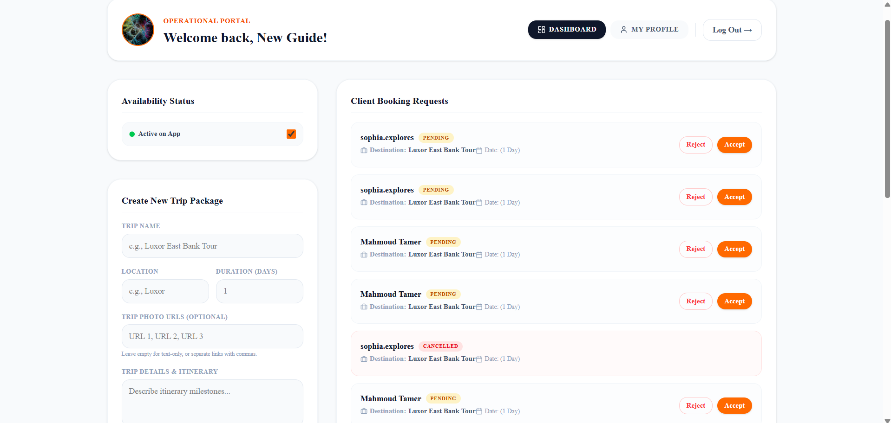
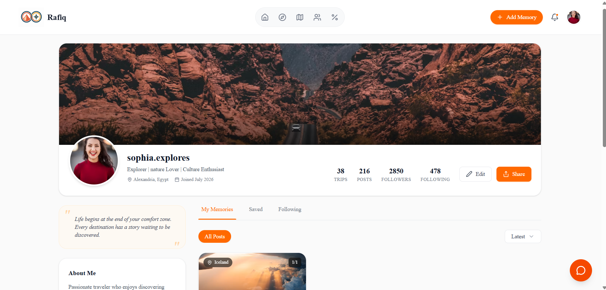
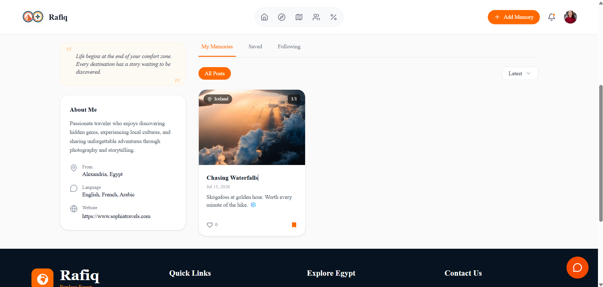
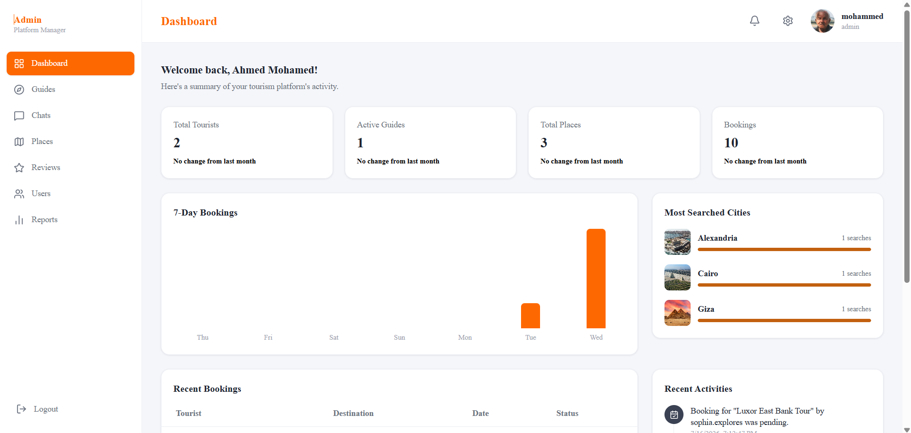
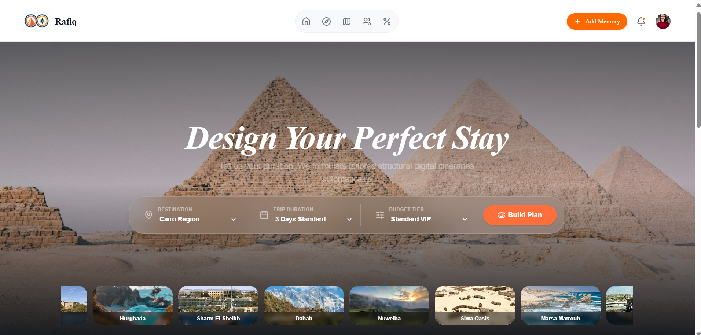

<p align="center">
  
</p>

<h1 align="center">Rafiq</h1>

<h3 align="center">
Your Intelligent Travel Companion for Exploring Egypt
</h3>

<p align="center">
Trip Planning • Verified Tour Guides • Smart Recommendations • Travel Safety • Cultural Experiences
</p>

<div align="center">


</div>

---

## 📑 Table of Contents

- [About Rafiq](#about-rafiq)
- [Core Features](#core-features)
- [Tech Stack](#tech-stack)
- [Architecture](#architecture)
- [Project Structure](#project-structure)
- [Screenshots](#screenshots)
- [API Overview & Authentication](#api-overview--authentication)
- [Getting Started](#getting-started)
- [Future Roadmap](#future-roadmap)
- [Meet the Team](#meet-the-team)

---

<a name="about-rafiq"></a>
## 📖 About Rafiq

Rafiq is a tourism platform designed to transform how tourists experience Egypt.

Instead of relying on multiple applications for planning, navigation, booking, safety, and communication, Rafiq brings everything together in one unified platform.

Whether you're visiting the Pyramids of Giza, exploring hidden local gems, booking a trusted guide, or searching for emergency assistance, Rafiq becomes your intelligent digital travel companion.

---

<a name="core-features"></a>
## ✨ Core Features

### 🗺 Smart Trip Planner
Plan trips based on:
- Budget
- Trip duration
- Preferred cities
- Travel style

### 🏛 Places Explorer
Discover:
- Historical Sites
- Museums
- Beaches
- Restaurants
- Local Markets
- Hidden Gems

Complete with images, ratings, reviews.

### 👨‍💼 Verified Tour Guide Marketplace
Find trusted, licensed guides with:
- Guide Profiles
- Ratings & Reviews
- Languages
- Experience
- Availability Calendar
- Direct Booking

### 💬 Real-Time Chat
Communicate directly with guides through:
- Instant Messaging
- Booking Discussion
- Trip Planning


---

<a name="tech-stack"></a>
## 🚀 Tech Stack

**Frontend**
- React.js
- Tailwind
- React Router

**Backend**
- Node.js
- Express.js
- REST API
- JWT Authentication

**Database**
- MongoDB Atlas


---

<a name="architecture"></a>
## 🏗 Architecture

```text
                   ┌────────────────────────────┐
                   │       React Frontend       │
                   │         Tailwind           │
                   └──────────────┬─────────────┘
                                  │
                         REST API │
                                  │
                   ┌──────────────▼─────────────┐
                   │      Express Backend       │
                   └──────────────┬─────────────┘
                                  │
                                  │                        
                                  ▼                         
                            MongoDB Atlas                          
```

---

<a name="project-structure"></a>
## 📂 Project Structure

```text
Rafiq
│
├── Client
│   ├── public
│   ├── src
│       │
│       ├── components
│       ├── pages
│       ├── hooks
│       ├── services
│       ├── assets
│       └── utils
│
├── Server
│   ├── controllers
│   ├── middleware
│   ├── models
│   ├── routes
│   ├── services
│   ├── config
│   ├── utils
│
└── README.md
```

---

<a name="screenshots"></a>
## 📸 Screenshots

| Home | Login |
|---|---|
|  |  |

| Places Explorer | Guide Marketplace |
|---|---|
|  |  |

| Tourist Profile | Memory Feed |
|---|---|
|  |  |

| Dashboard | Trip Plan |
|---|---|
|  |  |

---

<a name="api-overview--authentication"></a>
## 📡 API Overview & Authentication

### Authentication
Rafiq supports three account types **Tourist**, **Tour Guide**, and **Admin** secured with JWT.

```
POST /api/auth/register
POST /api/auth/login
GET  /api/auth/profile
```

### Places
```
GET    /api/places
GET    /api/places/:id
POST   /api/places
PUT    /api/places/:id
DELETE /api/places/:id
```

### Guides
```
GET  /api/guides
GET  /api/guides/:id
POST /api/guides
```

### Posts
```
GET    /api/posts
POST   /api/posts
PUT    /api/posts/:id
DELETE /api/posts/:id
```

### Bookings
```
POST /api/bookings
GET  /api/bookings
```

---

<a name="getting-started"></a>
## 🛠 Getting Started

### Environment Variables

Create a `.env` file in the `Server` directory with the following:

```env
MONGO_URI=
JWT_SECRET=
```
Create a `.env` file in the `Client` directory with the following:

```env
VITE_API_URL=
```
### Installation

**1. Clone the repository**
```bash
git clone https://github.com/nhahub/NHA-4-159.git
cd Rafiq
```

**2. Install frontend dependencies**
```bash
cd Client
npm install
```

**3. Install backend dependencies**
```bash
cd ../Server
npm install
```

**4. Run the backend**
```bash
npm run dev
```

**5. Run the frontend**
```bash
cd ../Client
npm run dev
```

### Responsive Design

Rafiq is optimized for:
- Desktop
- Laptop
- Tablet
- Mobile

---

<a name="future-roadmap"></a>
## 🚀 Future Roadmap

- [ ] AI Voice Assistant
- [ ] Push Notifications
- [ ] Smart Expense Tracker
- [ ] Online Payments
- [ ] Travel Communities
- [ ] Hotel Booking Integration

---

<a name="meet-the-team"></a>
## 👥 Meet the Team

| Member | Role |
|---|---|
| Eman Ashraf | Full Stack Developer |
| Basmala | Frontend Developer |
| Mahmoud | Frontend Developer |
| Mehrael | Frontend Developer |
| Gerges | Frontend Developer |
| Kirolos | Frontend Developer |


### ⭐ Support

If you like this project, don't forget to give it a ⭐ on GitHub!

---

<p align="center">
  <h2 align="center">🇪🇬 Explore Egypt Smarter with Rafiq</h2>
  <p align="center">Built with ❤️ by Team Rafiq</p>
</p>